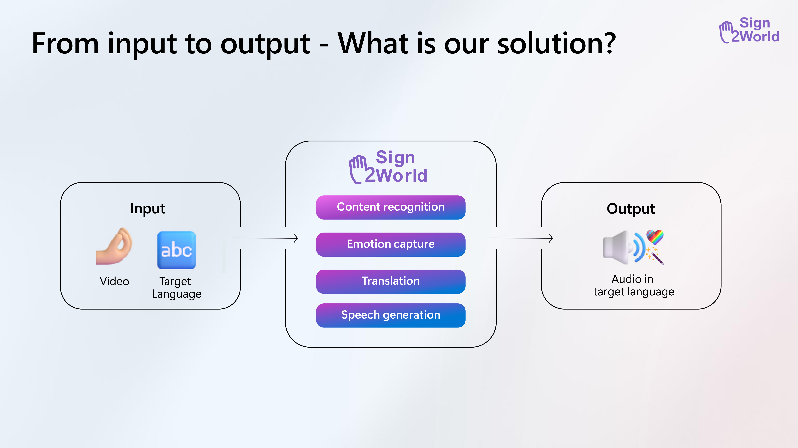

# Sign2World

This project was developed for the **Microsoft Global Intern Hackathon 2025**, focusing on **emotion-aware multilingual speech translation**. Our goal is to preserve the **emotional tone** (e.g., excited, neutral) of spoken English audio when translating it into other languages such as Chinese and German.



please check out the [slides](./data/Sign2World.pdf) for more details or download by this [link](./data/Sign2WorldSlides.pptx).

## 🌍 Project Overview

We explore how to retain **emotional expressiveness** in speech translation using AI models. The pipeline involves:

- 🎧 Input: English audio with emotional tone (e.g., excited)
- 🧠 AI Foundry: Baseline translation and synthesis
- 🌟 Our System: Emotion-preserving translation and synthesis


## 🎧 Emotion Translation Comparison Table

| Original English Audio | AI Foundry Result (Lang) | Our Result (Lang) | 
|------------------------|-----------------------------|-----------------------|
| [Excited.mp3](./data/source/Audio_EN_Excited.mp3) | [CN_AI_Foundry](./data/target/Audio_CN_AI_Foundry.wav) | [CN_Sign2World](./data/target/Audio_CN_Excited.mp3) |
| [Excited.mp3](./data/source/Audio_EN_Excited.mp3) | [DE_AI_Foundry](./data/target/Audio_DE_AI_Foundry.wav) | [DE_Sign2World](./data/target/Audio_DE_Excited.mp3) |
| [Excited.mp3](./data/source/Audio_EN_Excited.mp3) | [NL_AI_Foundry](./data/target/Audio_NL_AI_Foundry.wav) | [NL_Sign2World](./data/target/Audio_NL_Excited.mp3) |
| [Excited.mp3](./data/source/Audio_EN_Excited.mp3) | [HI_AI_Foundry](./data/target/Audio_HI_AI_Foundry.wav) | [HI_Sign2World](./data/target/Audio_HI_Excited.mp3) |

# Quickstart: Synthesize speech from Python using the Speech Service

This sample shows how to use the Speech Service through the Speech SDK for Python. It illustrates how the SDK can be used to synthesize speech to speaker output.

See the [accompanying article](https://docs.microsoft.com/azure/cognitive-services/speech-service/quickstarts/text-to-speech?tabs=dotnet%2Clinux%2Cjre%2Cwindowsinstall&pivots=programming-language-python) on the SDK documentation page for step-by-step instructions.

## Option 1: Run the Sample Easily in Visual Studio Code (Recommended)
This is the easiest way to get started. The Azure AI Speech Toolkit extension automates setup, environment configuration, build, and run.

- Install [Azure AI Speech Toolkit](https://marketplace.visualstudio.com/items?itemName=ms-azureaispeech.azure-ai-speech-toolkit) extension in VS Code.
- In extension's panel, click `View Samples` and download this sample from sample gallery.
- From the Command Palette (`Ctrl+Shift+P` / `Cmd+Shift+P`), run:
  - `Azure AI Speech Toolkit: Configure Azure Speech Resources` to select a speech resource (one-time setup).
  - `Azure AI Speech Toolkit: Configure and Setup the Sample App` to prepare the project (one-time setup).
  - `Azure AI Speech Toolkit: Run the Sample App` to run the sample.

## Option 2: Manual Setup and Run (Advanced)
Follow these steps if you prefer not to use VS Code.

### Prerequisites

Before you get started, here's a list of prerequisites:

* A subscription key for the Speech service. See [Try the speech service for free](https://docs.microsoft.com/azure/cognitive-services/speech-service/get-started).
* See the [Speech SDK installation quickstart](https://learn.microsoft.com/azure/ai-services/speech-service/quickstarts/setup-platform?pivots=programming-language-python) for details on system requirements and setup.

### Get the Speech SDK Python Package

**By downloading the Microsoft Cognitive Services Speech SDK, you acknowledge its license, see [Speech SDK license agreement](https://aka.ms/csspeech/license).**

The Cognitive Services Speech SDK Python package can be installed from [pyPI](https://pypi.org/) using this command:

```sh
pip install azure-cognitiveservices-speech
```

Note: this tutorial will not work without changes for any version earlier than 1.7.0 of the SDK.

### Run the sample

Before you run the sample code, replace the value `YourSubscriptionKey` with your subscription key and
replace the value `https://YourServiceRegion.api.cognitive.microsoft.com` with the endpoint for your Speech resource. You can find this endpoint in the Azure Portal under your Speech resource's "Keys and Endpoint" section.
You can either load the quickstart sample in your IDE and run it there or run it in a console by navigating to the directory you downloaded it to and running the command

```sh
python quickstart.py
```

Alternatively, you can run the sample `quickstart.ipynb` as a [Jupyter notebook](https://jupyter.org) file.

## Support

If you have a problem or are missing a feature, please have a look at our [support page](https://docs.microsoft.com/azure/cognitive-services/speech-service/support).

## References

* [Quickstart article on the SDK documentation site](https://docs.microsoft.com/azure/cognitive-services/speech-service/quickstart-text-to-speech-python)
* [Speech SDK API reference for C++](https://aka.ms/csspeech/pythonref)
